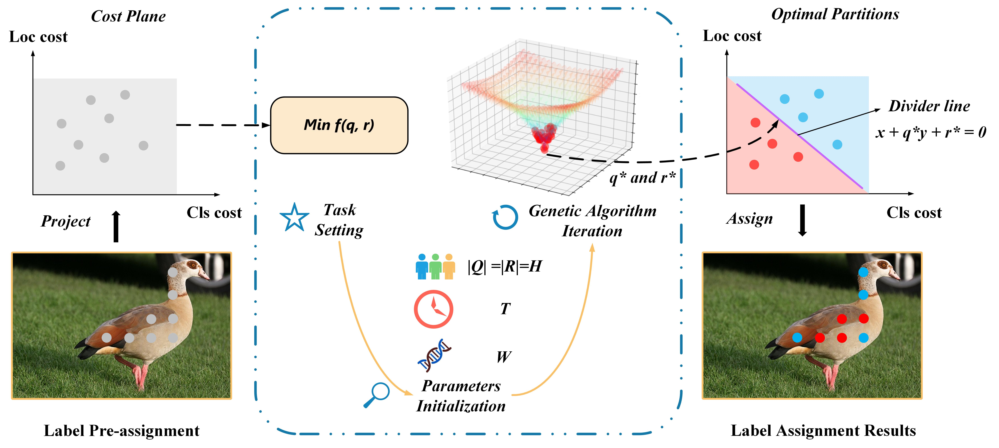

# OPA
Object detection via label assign technique
We will release the code in the future

## Paper
Optimal Partition Assignment for Universal Object Detection
Link : https://ieeexplore.ieee.org/document/9956875



## Citation
If Our work is useful or relevant to your research, please kindly recognize our contributions by citing our paper:
```bibtex
@article{yang2022optimal,
  title={Optimal Partition Assignment for Universal Object Detection},
  author={Yang, Yiran and Sun, Xian and Diao, Wenhui and Rong, Xuee and Yan, Shiyao and Yin, Dongshuo and Li, Xinming},
  journal={IEEE Transactions on Multimedia},
  year={2022},
  publisher={IEEE}
}
```
